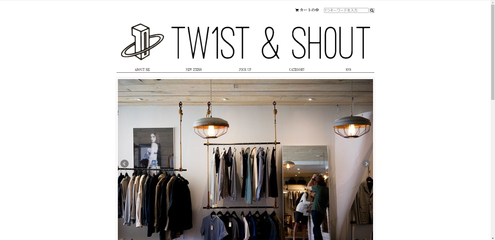
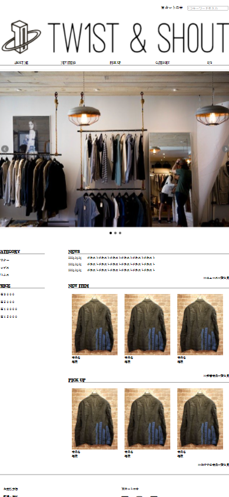

## TW1ST & SH0UT
アパレル系のECサイトです。 
レスポンシブに対応しているのでスマホからもご確認いただけます。

## URL
[TW1ST & SH0UT](https://haruki803.github.io/) 
トップページのみとなります。

## 使用技術
・HTML 
・CSS 
・JavaScript 

## 工夫点
・pcとスマホからストレスなく見れるレスポンシブルデザインにした点 
・アイテムが価格帯、服の種類、新着商品、おすすめ商品にカテゴライズされており、お客様が求めている商品を見つけやすくなっている点 
・スライドショーをページ上部に付けることで新着のコンテンツ、アイテムを満遍なく訪問者に告知できる点

## 今後付け足したい機能
・ユーザー登録、ログイン機能 
・お気に入り機能 
・閲覧数ランキング 
・各アイテムへのコメント機能 
・カート機能

## 課題点
・訪問者が買わずともサイトを一通り見ていただけるようなデザインが必要な点 
・まだまだ実装できない機能が多々あるために実装できる知識が必要な点 
